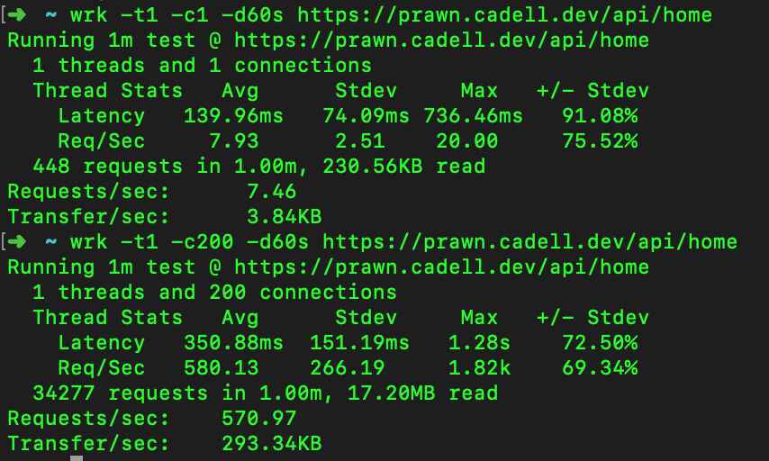

# PRAwN Stack

🦐 🍤 🦐 🍤 🦐 🍤 🦐 🍤 🦐 🍤 🦐 🍤

A Postgres, React, AWs and Node stack deployed with CDK in the free tier, almost.

- **P**ostgres.
- **R**eact.
- **Aw**s.
- **N**ode.

We're also using Typescript and NextJS for the frontend.


## Features

- Relational database so you can make cool stateful apps like a page view counter.
- Fun local development experience with docker-compose.
- Easy to deploy with AWS CDK.
- Almost completely in the AWS Free Tier. Turns out this is actually quite difficult with RDS and Lambda.

## Scripts

- `docker-compose up` starts postgres, the node api development server and the nextjs development server.
- `yarn start` run the development Node server.
- `yarn dev` run the NextJS development server.
- `yarn test` perform the jest unit tests.
- `yarn build` build the NextJS frontend so it's ready to deploy.
- `yarn cdk bootstrap --profile account-name` prepare the AWS region for cdk deployments.
- `yarn deploy --profile account-name` build the frontend and deploy the cdk stack.
- `yarn cdk destroy --profile account-name` destroy the deployment.

## Running Locally

1. Install dependencies.
   ```
   yarn
   ```
1. Run docker-compose.
   ```
   docker-compose up
   ```
   This will bring up:
   - Postgres database and run migrations on it using Flyway.
   - PgAdmin to access the Postgres database. Available at [http://localhost:5050/](http://localhost:5050/).
   - Node API development server. Available at [http://localhost:3001/api/](http://localhost:3001/api/).
   - NextJS development server for the frontend. Available at [http://localhost:3000](http://localhost:3000.

### Accessing the Local Database

1. Go to [http://localhost:5050/](http://localhost:5050/).
1. Login with:
   - **Email:** pgadmin4@pgadmin.org
   - **Password:** admin
1. Click Add New Server.
1. Fill in the local server details.
   - General
     - **Name:** local
   - Connection
     - **Host:** postgres
     - **Username:** postgres
     - **Password:** changeme
     - **Save password?:** yes

## Almost Completely in the Free Tier!


The only thing you have to pay for is Secrets Manager which is \$0.4/month.

When the free tier ends after 12 months you could move this onto a t3.micro for rds at $0.028/h, $21/month) and a t3.nano for ec2 (used as a cheap NAT) at $0.0066/h, $4.95/month.

There's also a budget configured with cdk to alert you when you spend more than \$1 usd to remind you when the free tier ends.

### Serverless and Lambda

I'm a _serverless skeptic_. A few timely things swayed me to try Lambda for this project.

1. [serverless-express](https://github.com/vendia/serverless-express) allows you to run an express app in Lambda, which means you can run the express part locally for a nice development experience.
1. I wanted to setup some cron jobs which are well suited to Lamdbda.
1. AWS CDK makes working with AWS ~~easy~~ less hard.

It turns out the simplest way to setup Lambda with RDS is quite expensive. You have to [use a NAT Gateway](<(https://aws.amazon.com/premiumsupport/knowledge-center/internet-access-lambda-function/)>) which costs $0.059/h and $44.25/month. [That's expensive!](https://forums.aws.amazon.com/thread.jspa?threadID=234959).

There's a few ways to get around this:

- Make your database public. This isn't secure.
- Make your Lambda private so it can't access the internet. The internet is useful though and you'll have to [pay](https://aws.amazon.com/privatelink/pricing/) to access AWS services like Secret Manager.
- Setup a NAT Instance in the free tier.

This all feels very typical of AWS.

I went with the NAT Instance because thankfully [CDK makes it easy](https://docs.aws.amazon.com/cdk/api/latest/docs/aws-ec2-readme.html#using-nat-instances). Unfortunately, it did seem to add some extra latency but I'll happily cop latency instead of money for this project.

## Load Testing



With more load, our application can support a throughput of 570 requests per second on average or about 49.2 million per day at 350ms latency. 350ms is still pretty fast and if we had a higher tolerance for latency then this stack could probably do more.

You can install [wrk](https://github.com/wg/wrk) with:

```
brew install wrk
```

Then run it with:

```
wrk -t1 -c1 -d60s https://prawn.cadell.dev/api/home
```

If you want to go further with load testing then maybe have a look at [vegeta](https://github.com/tsenart/vegeta), [wrk2](https://github.com/giltene/wrk2) or [k6](https://k6.io/).

Load testing goes really deep apparently but I found [How percentile approximation works (and why it's more useful than averages)](https://blog.timescale.com/blog/how-percentile-approximation-works-and-why-its-more-useful-than-averages/) was a good introduction to percentiles, as well as the [hacker news comments](https://hn.premii.com/#/comments/28526966), which is where I found [How NOT to Measure Latency](https://www.youtube.com/watch?v=lJ8ydIuPFeU) by Gil Tene, which is amazing! There's also an [article](http://highscalability.com/blog/2015/10/5/your-load-generator-is-probably-lying-to-you-take-the-red-pi.html) similar to the talk but I much prefer the talk (and I don't usually watch talks).

Vegeta, wrk2 and k6 all avoid the coordinated omission problem mentioned in Gil's talk, if you use constant throughput modes. [It's called something slightly different in k6](https://community.k6.io/t/is-k6-safe-from-the-coordinated-omission-problem/1484) though.

## How does it work?


[Mermaid Diagram](https://mermaid-js.github.io/mermaid-live-editor/edit#eyJjb2RlIjoic2VxdWVuY2VEaWFncmFtXG4gICAgYXV0b251bWJlclxuICAgIHBhcnRpY2lwYW50IFVzZXJcbiAgICBwYXJ0aWNpcGFudCBDcm9uXG4gICAgcGFydGljaXBhbnQgQVBJXG4gICAgcGFydGljaXBhbnQgRGF0YWJhc2VcbiAgICBVc2VyLT4-QVBJOiBJJ20gaGVyZSwgaG93IG1hbnkgcGFnZXZpZXdzIGhhdmUgeW91IGhhZD9cbiAgICBBUEktPj5EYXRhYmFzZTogU2VsZWN0IGNvdW50IGZyb20gYWN0aXZpdHkgdGFibGVcbiAgICBEYXRhYmFzZS0-PkFQSTogVGhpcyBtYW55XG4gICAgQVBJLT4-RGF0YWJhc2U6IFRoYW5rcywgYWRkIG9uZSBtb3JlIHBhZ2V2aWV3IHBsZWFzZVxuICAgIERhdGFiYXNlLT4-QVBJOiBEb25lXG4gICAgQVBJLT4-VXNlcjogV2UndmUgaGFkIHRoaXMgbWFueSBwYWdldmlld3NcblxuICAgIFVzZXItPj5BUEk6IEhvdyBtYW55IHBhZ2V2aWV3cyBoYXZlIHdlIGhhZCBwZXIgaG91cj9cbiAgICBBUEktPj5EYXRhYmFzZTogU2VsZWN0ICogZnJvbSBhY3Rpdml0eV9ob3VybHlfcm9sbHVwIHRhYmxlXG4gICAgRGF0YWJhc2UtPj5BUEk6IEhlcmUncyB0aGUgcm93c1xuICAgIEFQSS0-PlVzZXI6IEhlcmUncyB0aGUganNvblxuXG4gICAgb3B0IFJvbGx1cHMgIFxuICAgIENyb24tPj5BUEk6IEl0J3MgYmVlbiBhbiBob3VyLCBjYW4geW91IHBsZWFzZSByb2xsdXAgdGhlIGFjdGl2aXR5IHRhYmxlXG4gICAgQVBJLT4-RGF0YWJhc2U6IEhvdyBtYW55IHBhZ2V2aWV3cyBoYXZlIHdlIGhhZCBpbiB0aGUgbGFzdCBob3VyXG4gICAgRGF0YWJhc2UtPj5BUEk6IFRoaXMgbWFueVxuICAgIEFQSS0-PkRhdGFiYXNlOiBJbnNlcnQgaW50byBhY3Rpdml0eV9ob3VybHlfcm9sbHVwIHRhYmxlXG4gICAgRGF0YWJhc2UtPj5BUEk6IERvbmVcbiAgICBlbmRcbiAgIiwibWVybWFpZCI6IntcbiAgXCJ0aGVtZVwiOiBcImRhcmtcIlxufSIsInVwZGF0ZUVkaXRvciI6ZmFsc2UsImF1dG9TeW5jIjp0cnVlLCJ1cGRhdGVEaWFncmFtIjpmYWxzZX0)

### Performant Analytics with Rollups

We have a graph that shows the pageviews per hour and there's a few ways to make that happen.

1. Calculate the aggregates when they're requested. This is the easiest and will be up to date but it can be slow and resource intensive if it's requested often.
1. Setup a materialised view and refresh it on an interval. This is a natural extension of the first solution but will be much faster at the cost consistency because it might be stale. This also might be resource intensive if the table is big enough or the aggregates are complicated enough.
1. Iteratively calculate the aggregates and store them manually. The materialised view solution might recalculate aggregates that aren't going to change because they might be in the past. E.g the pageviews for last month aren't going to change to why recalculate them. This is the approach we've taken here.

I would recommend starting with the first one then escalating to more complicated solutions as required but I wanted to explore the third solution with this project.

## First Deploy

Make sure you setup email forwarding for `admin` @yourdomain (e.g `admin@cadell.dev`) you receive the email from aws to validate that you own the domain so it can create a certificate.

1. Create an [AWS account](https://aws.amazon.com/).
1. Click Signin.
1. Click Create a new AWS account.
1. Enter your details.
1. Go to IAM.
1. Enable MFA on your Root account. I recommend 1Password.
1. Create an IAM user with programmtic access and assign the AdministratorAccess permission.
1. Download the credentials.
1. Create a `.aws` folder if you don't already have one.
   ```
   mkdir ~/.aws
   ```
1. Create a credential file with `vi ~/.aws/credentials`.
   ```
   [account-name]
   aws_access_key_id=
   aws_secret_access_key=
   ```
1. Run `yarn` to install dependencies.
1. Set the region in `bin/prawn-cdk.ts`.
1. Update `yourPublicIpAddress` in `lib/prawn-stack.ts` with your public ip address so you can access the database.
1. Run `yarn cdk bootstrap --profile account-name`.
1. Run `yarn cdk deploy CertificateStack --profile account-name`.
   - This will send an email to `admin@yourdomain` to confirm you control the domain for the certificate it's creating. You can also go into CertificateManager in the `us-east-1` region and resend it if you need to.
   - The command won't finish until you approve the email.
1. Copy the certificateArn from the output and add it to the `bin/prawn-cdk.ts`.
1. Run `yarn deploy --profile account-name`.
   - This takes about about 15 mins.

### Future Deploys

This takes about 1-3 mins.

```
yarn deploy --profile account-name
```

### Access the Database

You'll need to do this to setup the database initially.

Access is currently through a whitelisted ip address which isn't ideal but will work well enough for now.

1. Make sure the `yourPublicIpAddress` in `lib/prawn-stack.ts` is up to date and deployed.
1. Login to the AWS console.
1. Select the region, probably `ap-southeast-2`.
1. Go to Secret Manager.
1. Click `PrawnStack-rds-credentials`.
1. Go to the `Secret value` section then click `Retrieve secret value`.

You can put the values into PgAdmin to query the database.

### Setup the Database

Run the following command to migrate the database with Flyway.

```
HOST=xxx USER=xxx PASSWORD=xxx; docker-compose run flyway -url=jdbc:postgresql://$HOST/postgres -user=$USER -password=$PASSWORD migrate
```

### Setup a Custom Domain

1. Sign into your domain registrar. I use [Google Domains](https://domains.google.com).
1. Setup a new CNAME DNS record using the coudfront domain in the deploy output.
1. Make sure the CNAME aligns with the `customDomain` in `bin/prawn-cdk.ts`.

### Destroy the Stack

```
yarn cdk destroy --profile account-name
```

### Why is AWS Charging You?

1. Login to the root account.
1. On the account dropdown on the top right, click My Billing Dashboard.
1. Click Cost Explorer.
1. Click Daily Spend View.
1. Change the timeframe to the last 7 days.
1. Group by Usage Type.

The table below will give you a decent breakdown on your charges.

## Inspiration

The LAMP Stack (Linux, Apache, MySQL, PHP) is the inspiration for this project. I made a terrible chat app with it when I was in year 10 to get around the school's internet filter but it worked and it was really fun.

The best parts:

- Free hosting with dodgy hosts.
- Good local development with [MAMP](https://www.mamp.info/en/mac/).
- Relational database.
- Fun.

Some [other people](https://news.ycombinator.com/item?id=21567577) also agree.

I wanted to see if I could create a stack with similar qualities with more modern tools.

## Roadmap

### Ideas

1. Setup MDX on NextJS pages and add some more copy about the project.
1. Setup integration tests.
1. Email me when the scheduled pageview fails for basic monitoring.
1. Set a maximum Lambda concurrency.
1. Use [serverless-postgres](https://github.com/MatteoGioioso/serverless-pg) for connecting to postgres.
1. Setup provisioned concurrency.

### Done

- Graph the pageviews per hour with Nivo.
- Setup an hourly pageview.
- Setup an hourly activity rollups for analytics.
- Setup activity table.
- Fixed the latency issue by tweaking cloudfront settings.
- Cache secrets from SecretManager. Didn't make much difference to latency but it does reduce compute time which reduces costs.
- Setup X-Ray tracing.
- Load testing results with wrk.
- Custom domain.
- Setup a budget in cdk.
- Moved setup the api and frontend in docker-compose. It's a bit slow though.
- Setup flyway for database migrations.
- Setup a NAT Instance to save on PrivateLink costs and allow internet access for Lambdas.
- Document the inspirations for this project.
- Setup frontend with nextjs.
- Setup pageViews in deployed environment.
- Set the NAT Gateways to 0 after being charged. Lucky I had a Budget!
- Setup pageViews with local postgres database.
- Setup serverless-express to make routing conistent for local and deployed environments.
- Setup Express to call the same handler as Lambda.
- Deploy a cdk stack with RDS and Lambda.

## Related Projects

- [cadbox1/backend-frontend-aws-cdk](https://github.com/cadbox1/backend-frontend-aws-cdk).
- [cadbox1/internal-magic-links-aws-cdk](https://github.com/cadbox1/internal-magic-links-aws-cdk).
- [cadbox1/node-api-2020](https://github.com/cadbox1/node-api-2020).
- [cdk-patterns-serverless/the-rds-proxy](https://github.com/cdk-patterns/serverless/tree/main/the-rds-proxy).
- [wclr/ts-node-dev](ts-node-dev).
- [vendia/serverless-express](https://github.com/vendia/serverless-express).
- [khezen/compose-postgres](https://github.com/khezen/compose-postgres)
